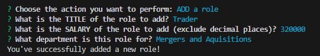

# Whos-Who-Employee-Tracker
Employee Tracker (command line CMS) using Node.js MySQL and Inquirer

## Description

The Who's Who Employee Tracker is a command line CMS tool used to query bankcompany_db, a MySQL database.  This tool tool is written using Node.js, Inquirer and MySQL.  This employee tracker demonstrates good organizational skills by using classes and reusable functions which reduces errors, increases efficiency, and makes the code more easily read.

The use of functions within the Inquirer choices for list prompts provides a good user experience and allows the code to be dynamic in nature by querying the database for the most recent information when a list choice is presented to the user.

Link to video recording: [Video Recording](https://watch.screencastify.com/v/JyFXj7crvP3ofKrr5Hmc)  
Link to live README: [https://github.com/Moebirdie/Whos-Who-Employee-Tracker/](https://github.com/Moebirdie/Whos-Who-Employee-Tracker/)

## Table of Contents

1. [Installation](#Installation)
2. [Features](#Features)
3. [Usage](#Usage)
4. [Visual Description](#Visual-Description)
5. [Contributors](#Contributing)
6. [Questions](#Questions)
7. [License](#License)
  

## Installation 

A user installs this application by:  

	1. Cloning the Who's Who Employee Tracker  

	2. Installing Node.js  

	3. Installing Inqirer.js and MySQL
 
 The packages can be installed by deleting the package-lock.json and running npm i or npm install.
  

## Features 

Features exhibited in this application include question prompts which either produce a table with the data from the database or a success message.
  

## Usage 

This application is intended as a tool to query a set of tables within a database.  In addition to viewing data, the user has the ability to modify (update) information, add information and delete information. (All CRUD operations.)
  

## Visual Description 

A visual representation of the working application may be seen here:  

### Database schema creation and seed data    

      

### Class structure  

  

### Reusable functions  

  

### Sample questions function  

    

### Sample view employee choice result

  

### Sample view when an action to update the database has completed  

  

### Sample result of query with calculation  

  

## Contributors 

Any user can create a branch, commit their changes and create a pull request to be reviewed. All contributions are welcome!

  
## Questions  

Questions can be directed to maureen.business@gmail.com or submitted via my Github account at [https://github.com/Moebirdie/Whos-Who-Employee-Tracker](https://github.com/Moebirdie/Whos-Who-Employee-Tracker).
  

## License 

[MIT](https://opensource.org/licenses/MIT)
